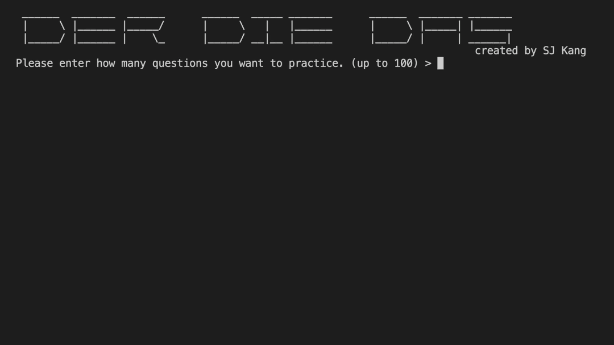

# derdiedas-c

Command-line quiz generator to memorize the gender of German nouns 🇩🇪

Even in an environment without internet, you can practice the gender of German nouns anytime and anywhere as long as you have your computer.

Übung macht den Meister. Toi toi toi!

## Build & Run

Build the binary with `make` using the following command:

```sh
make
```

Then run it with the following command:

```
make run
```

## Example


